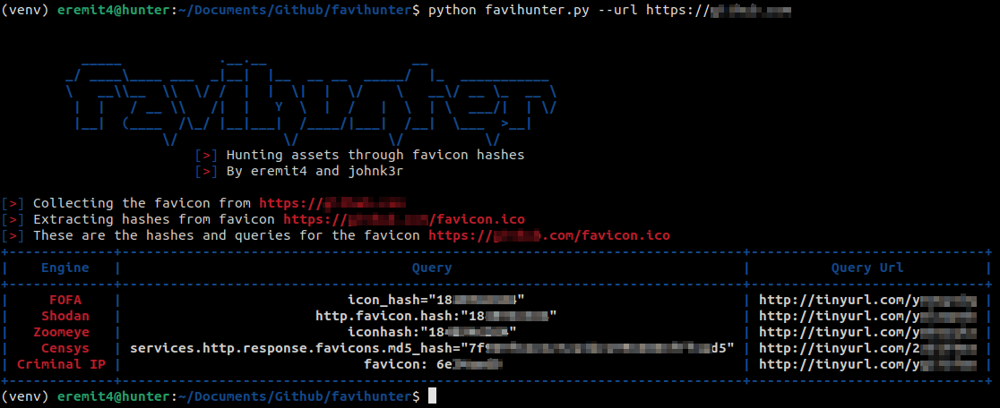

# FaviHunter
> Favicons are small icons in modern web applications that could be very useful for us in our day-to-day hunting activities, especially when we combine these icons with modern search engines to find assets on the internet. 

> This project aims to help a security professional find assets on the internet using favicon hashes on search engines such as [FOFA](https://en.fofa.info/), [Shodan](https://www.shodan.io/), [Censys](https://search.censys.io/), [Zoomeye](https://www.zoomeye.org/), and [Criminal IP](https://www.criminalip.io/).
The program returns a table with the custom queries of each search engine and their shortened URL with the query applied.

## 🔧 Setup

Cloning the project:
```bash
git clone https://github.com/eremit4/favihunter.git
```
Optional - Creating a virtualenv before installing the dependencies
> Note: The use of virtual environments is optional, but recommended. In this way, we avoid possible conflicts in different versions of the project's dependencies.
> Learn how to install and use virtualenv according to your OS [here](https://virtualenv.pypa.io/en/latest/)

Installing the dependencies:
```bash
pip install -r requirements.txt
```

## 🕵️‍♂️ Using

Discovering the project capabilities:
```bash
python favihunter.py --help
```

Analyzing a specific URL:
```bash
python favihunter.py --url <url address>
```

Analyzing a file with URLs:
```bash
python favihunter.py --urls-file <file path>
```

Analyzing a local favicon image:
```bash
python favihunter.py --favicon <file path>
```

Cleaning the favicon local directory:
```bash
python favihunter.py --remove-favicons
```


